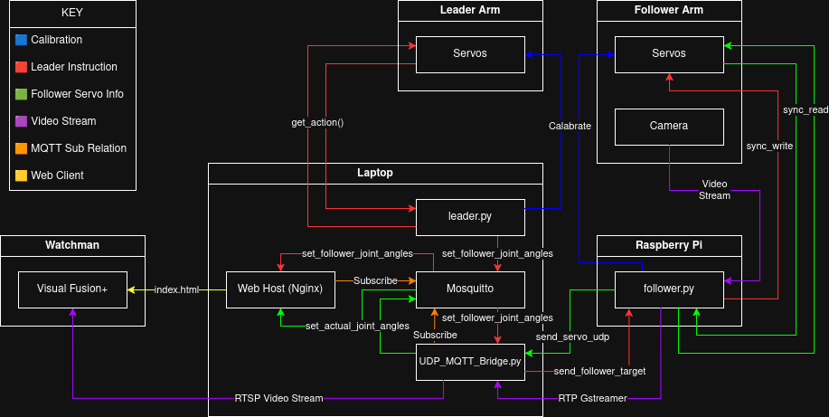

# SO-101 DIGITAL TWIN 

This Project was designed over my 4th year student workplacment with Rinicom. If you have any questions about the project that are not answered bellow feel free to reach out to me on my personal email nialldorrington@btinternet.com.

## Project overview
The following codebase allows for real time Teleoperation and Digital Twin Vissulization of the SO-101 Robot Arms. 

You will need:
- SO-101 Leader and follower arms (See SO-101 Robot Arm Details and Maintenance)
- Rasbery Pi (recomended), or other device to connect the follower arm to.
- Linux Host Device (e.g Laptop), for hosting front-end, sending leader MQTT updates, and sending/reciving from the follower Pi via UDP
- (Optional) Another Host Device for hosting Visual Fusion+ Video wall (Watchman)
- (NOTE: System could be set up with only one host device that also runs the Visual Fusion+ Video wall, but the set-up guide will assume a seperate device is being used)

This project was made with the goal of taking it down a mineshaft, hench why a seperate Rasberry Pi is connected to the follower SO-101 arm. The mineshaft project had a radio connection between the leader arm and the follower Pi, therefore send/recive from our Host Device using UDP as dropped packets are expected.

## Setup 
For a detailed break down on how to set up the system please follow the setup guide 

## Usage Guide
For a detailed break down on how to use all the systems functionality, once you've set up the system please follow the usage guide

## Project Discription and System Justifications

Now that you have the system up and running and hopfully understand how to use it below I will go into more detail about the codebase. This will hopefuly provide a more technical discription of system choices, helping with a future development or potential magpying for future projects.

The code base is broken down into:
- front-end: HTML & JS for the web digital twin 
- lerobot: Code taken from the OpenSource Lerobot git https://github.com/huggingface/lerobot
- scripts: Custom Python scripts for the SO-101 Leader & Follower & Cammera that run on the Pi and host device

Here's a diargram showing the data flows (This might cause more confussion, I prommise its not as complicated as it looks)

### Features

- Calabration insures that the follower arm will not attempt to move past servo limits avoiding damage.

- The current systems follower will handle dropped packets by moving in safe increments towards the last recived leader position and periodicaly sending arm states while idle.

- When a MQTT request is stale for either leader or follower (last send was over 5 secconds ago), the relevant digital twin will go red. Indicating to the user an error/inacurate current display.

- In cases of low bandwidth RTP video packets are dropped over servo instructions and feedback. 

- After monitoring using the /scripts/monitor_udp.py, for 15 minutes of constant leader arm movement updates to the follower, the total avarage Kbps was 768.43 

## SO-101 Robot Arm Details and Maintenance 

A full guide on the SO-101 Robot arms can be found within this git README.md https://github.com/TheRobotStudio/SO-ARM100. This details the documentation, bill of materials and links to pre buit arms that are avalible to purchase.

- NOTE: As of 17/03/2026 the current Rinicom Leader arm gripper servo is a little dammaged. So far it works fine but has some resistance and "crunch" when extended around 90°. The Servo needed to replace this was identified from the above link as STS3215 Servo 7.4V, 1/147 gear (C046).

- NOTE: As of 18/02/2026 the USB-C port on the Follower arm came of and had to be re soldered. It clearly seems like the original soldering job wasn't great so be careful with other connections especialy the USB-C port on the Leader arm as its probably the same.
